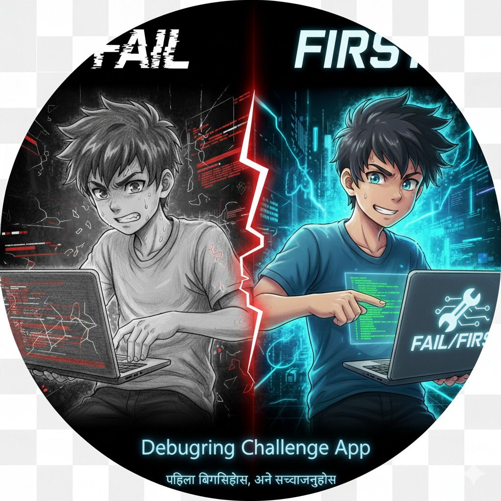

# FailFirst - Debugging Challenge App

A gamified learning platform where you learn programming by fixing bugs!
Now with **60+ Challenges** across 3 languages and polished UI animations.

## Features

- 🎮 **Gamified Learning**: XP, streaks, and achievements
- 🐛 **Debug Challenges**: Learn by fixing real bugs
- 📖 **Story-based Lessons**: Engaging narratives for each concept
- 🏆 **Multi-language Support**: C, C++, Java
- 💾 **Portable Database**: Saves progress next to the app
- 🔧 **Portable Compilers**: Works without system compilers (TCC)
- ✨ **New Animations**: Smooth transitions and feedback effects

## Content Stats

- **C++**: 25+ Modules (Basics to Expert OOP)
- **C**: 20+ Modules (Pointers, Memory, Structs)
- **Java**: 15+ Modules (OOP, Interfaces, Collections)

## Quick Start (Windows)

1. **Extract** the zip file.
2. **Double-Click** `scripts/build_windows.bat` (if compiling) OR `FailFirst.exe` (if pre-built).
3. **Enjoy!**

## Creating Single Portable .exe

See [deployment/PORTABLE_BUILD.md](deployment/PORTABLE_BUILD.md).

1. Build using `scripts/build_windows.bat`
2. Use **Enigma Virtual Box** to pack everything into one file.

## Requirements

- Qt 6.x (MinGW)
- Windows 10/11
