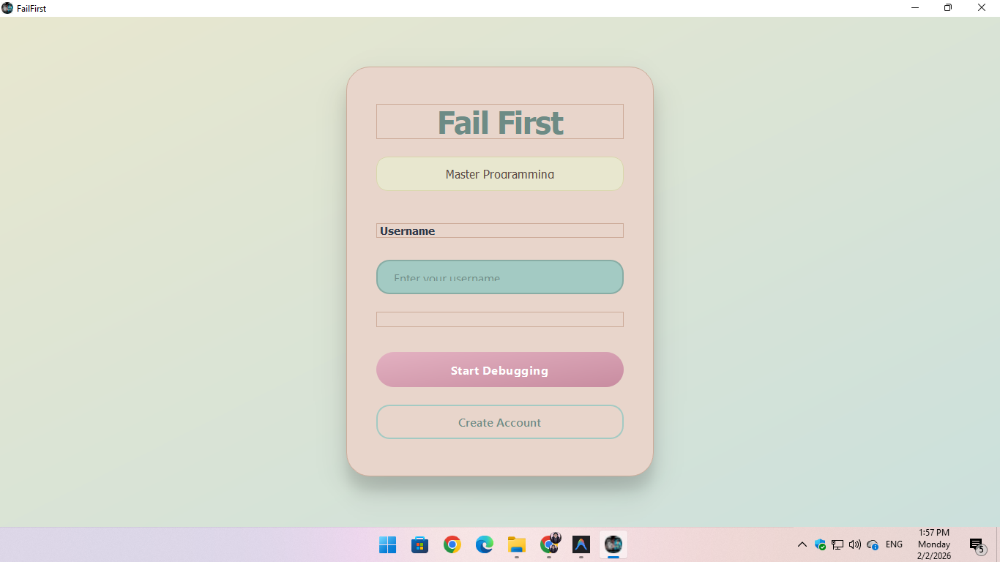
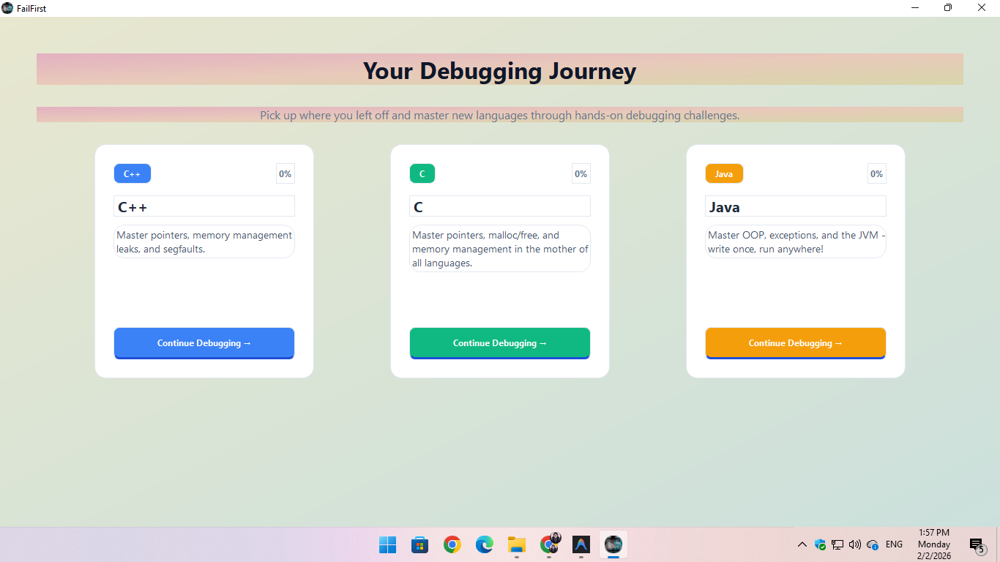
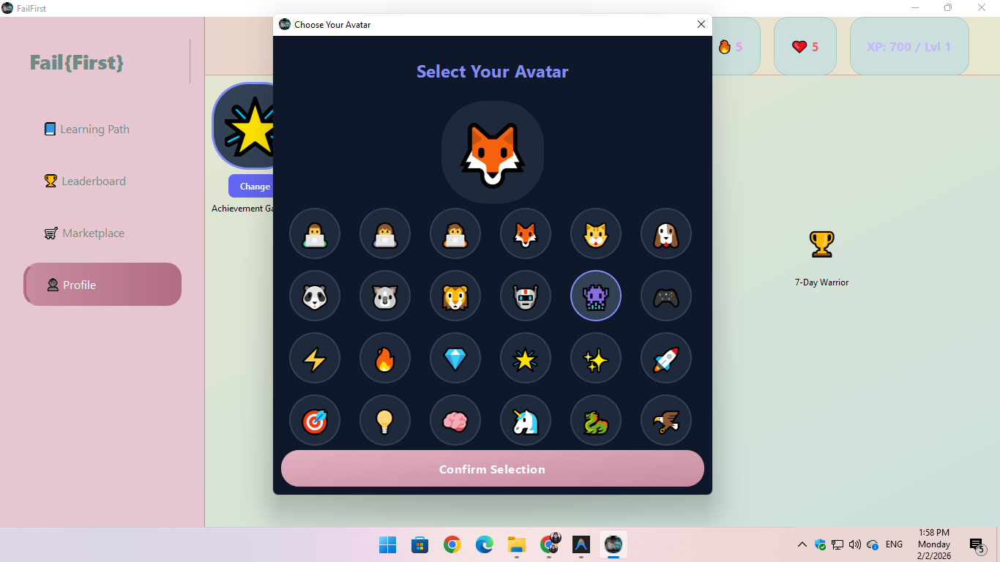
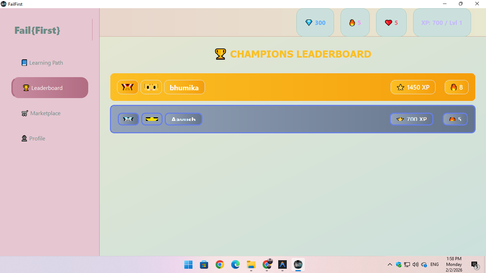
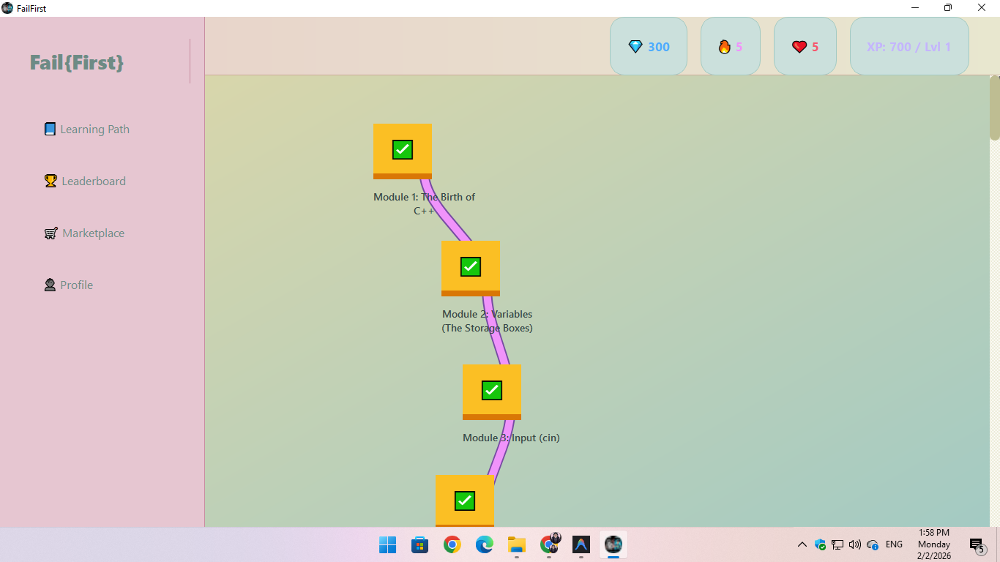
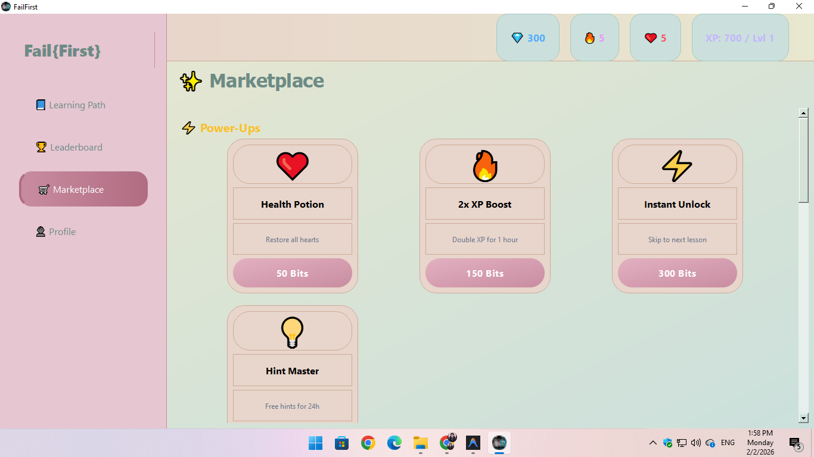

# FailFirst — Learn Programming by Fixing Bugs

> A gamified code-learning platform where you learn programming by **fixing
> bugs** — not by writing code from scratch.

FailFirst turns debugging into a game. Story-driven lessons drop you into
deliberately broken code; you find and fix the bugs, and the app compiles and
runs your solution against hidden tests to give you instant feedback. Progress,
XP, streaks, and achievements keep you hooked.

> **Status:** v3.0 — 60 debug challenges across C, C++, and Java with a polished,
> animated UI.

## Features

- 🎮 **Gamified learning** — XP, streaks, and achievements
- 🐛 **Debug challenges** — learn by fixing real bugs
- 📖 **Story-based lessons** — quizzes and narratives for every concept
- 🏆 **Multi-language** — C, C++, and Java
- ⚡ **Instant validation** — a bundled TCC compiler checks your fix, no system
  compiler required
- 💾 **Portable** — data and progress saved next to the .exe
- ✨ **Animated UI** — smooth transitions and feedback effects (v3.0)

## Content

| Language | Challenges |
| -------- | ---------- |
| C++      | 25 modules — basics to expert OOP |
| C        | 20 modules — pointers, memory, structs |
| Java     | 15 modules — OOP, interfaces, collections |

## Screenshots

| Auth | Language selection | Avatar picker |
| --- | --- | --- |
|  |  |  |

| Leaderboard | Levels | Shop |
| --- | --- | --- |
|  |  |  |

## Quick Start (Windows)

1. **Extract** the portable package (`FailFirst_Portable_Package.zip`) or build from source.
2. **Double-click** `FailFirst.exe`.
3. Register an account and start debugging!

## Building from Source

Requires **Qt 6.x (MinGW)** — default path `C:\Qt\6.9.2\mingw_64`.

```bat
scripts\build_windows.bat
```

or

```powershell
.\scripts\build_windows.ps1 -QtPath "C:\Qt\6.9.2\mingw_64"
```

Linux → Windows cross-compile (requires MXE):

```bash
./scripts/cross_compile.sh
```

Output lands in `deploy\FailFirst.exe`.
For a single-file portable build, see [deployment/PORTABLE_BUILD.md](deployment/PORTABLE_BUILD.md)
(Enigma Virtual Box guide).

## Tech Stack

| Layer      | Technology                                     |
| ---------- | ---------------------------------------------- |
| Language   | C++17                                          |
| GUI        | Qt 6.x (Core, Widgets, Sql, Network; Qt 5 fallback) |
| Build      | CMake ≥ 3.16, Qt AUTOMOC/AUTORCC/AUTOUIC       |
| Database   | SQLite (portable, next to the .exe)            |
| Code eval  | TCC (bundled, for C/C++); Java/Python use system |
| Tooling    | MinGW, MXE cross-compile scripts               |

## Project Structure

```
├── src/
│   ├── main.cpp              # entry: DB init → splash → dashboard
│   ├── core/                 # EconomyManager, GamificationEngine, Validator, CompilerManager
│   ├── database/             # DatabaseManager (SQLite)
│   └── ui/                   # Dashboard, Learn/Challenge sections, login, avatar, splash…
├── resources/                # challenges.json (+ C/Java), icons, tcc.zip
├── scripts/                  # build_windows.bat/.ps1, cross_compile.sh
├── deployment/               # PORTABLE_BUILD.md, windows-toolchain.cmake
├── presentaion/              # interactive HTML slide deck + screenshots
└── FailFirst_Portable_Package.zip   # prebuilt portable build
```

## License

See the LICENSE file in this repository.